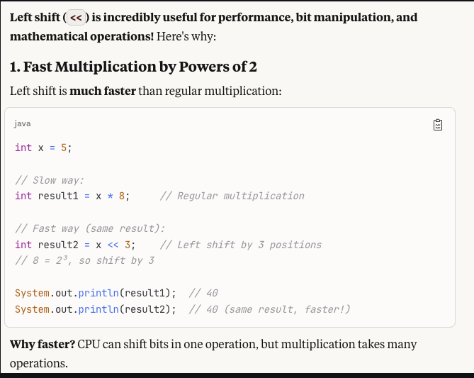
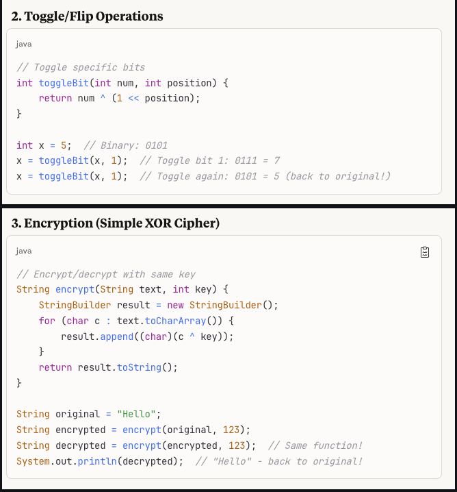
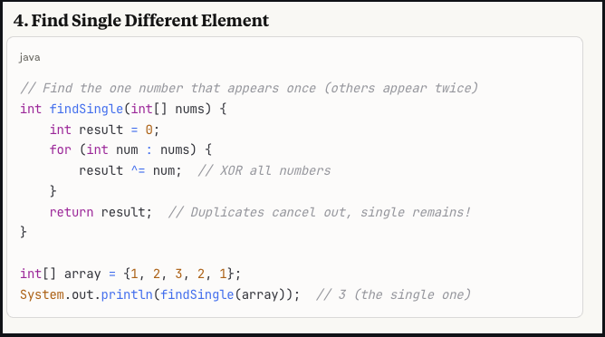

The four essential XOR properties:

Same numbers XOR to zero: a ^ a = 0
XOR with zero returns original: a ^ 0 = a
Commutative: a ^ b = b ^ a
Associative: (a ^ b) ^ c = a ^ (b ^ c)

# Java Bitwise Operations Cheat Sheet

## 1. Decimal to Binary Conversion

### Method: Repeated Division by 2

Divide the number by 2 repeatedly and record the **remainders** from bottom to top.

**Example:** Convert `13` to binary

| Step | Division | Quotient | Remainder |
|------|----------|----------|-----------|
| 1 | 13 ÷ 2 | 6 | **1** |
| 2 | 6 ÷ 2 | 3 | **0** |
| 3 | 3 ÷ 2 | 1 | **1** |
| 4 | 1 ÷ 2 | 0 | **1** |

**Read remainders bottom → top:** `1101`

So `13` in decimal = `1101` in binary ✅

---

### Quick Verification (Binary to Decimal)

```
1101 = (1 × 2³) + (1 × 2²) + (0 × 2¹) + (1 × 2⁰)
     = 8 + 4 + 0 + 1
     = 13 ✅
```

---

### Converting Negative Decimals (Two's Complement)

**Step-by-Step Method:**

| Step | Action |
|------|--------|
| 1 | Convert the **positive** version to binary |
| 2 | Pad with leading zeros to fill the bit width (8, 16, or 32 bits) |
| 3 | **Invert** all bits (0 → 1, 1 → 0) |
| 4 | **Add 1** to the result |

**Example:** Convert `-13` to 8-bit binary

| Step | Action | Result |
|------|--------|--------|
| 1 | Convert `13` to binary | `1101` |
| 2 | Pad to 8 bits | `0000 1101` |
| 3 | Invert all bits | `1111 0010` |
| 4 | Add 1 | `1111 0011` |

So `-13` in 8-bit two's complement = `1111 0011` ✅

---

### Verification (Convert Back to Decimal)

```
1111 0011
↓ Sign bit is 1 → negative number
↓ Invert: 0000 1100
↓ Add 1:  0000 1101 = 13
↓ Apply sign: -13 ✅
```

---

### Java Shortcuts

```java
// Decimal to Binary String
Integer.toBinaryString(13);   // "1101"
Integer.toBinaryString(-13);  // "11111111111111111111111111110011" (32-bit)

// Binary String to Decimal
Integer.parseInt("1101", 2);  // 13

// Manual negative conversion
int positive = 13;            // 0000 0000 0000 0000 0000 0000 0000 1101
int inverted = ~positive;     // 1111 1111 1111 1111 1111 1111 1111 0010
int negative = inverted + 1;  // 1111 1111 1111 1111 1111 1111 1111 0011

System.out.println(negative); // -13 ✅
```

---

### Summary Formula

```
Negative binary = Invert(Positive binary) + 1
       -n       =        ~n               + 1
```

---

### Power of 2 Reference Table

| 2ⁿ | Decimal | Binary |
|----|---------|--------|
| 2⁰ | 1 | `0001` |
| 2¹ | 2 | `0010` |
| 2² | 4 | `0100` |
| 2³ | 8 | `1000` |
| 2⁴ | 16 | `1 0000` |
| 2⁵ | 32 | `10 0000` |
| 2⁶ | 64 | `100 0000` |
| 2⁷ | 128 | `1000 0000` |

> 💡 **Tip:** Memorizing powers of 2 makes mental binary conversion much faster!

---

## 2. Why Leading Zeros?

### Fixed Bit Width in Computers

Computers store integers in **fixed sizes**:

| Type (Java) | Bits | Example: 13 |
|-------------|------|-------------|
| `byte` | 8 bits | `0000 1101` |
| `short` | 16 bits | `0000 0000 0000 1101` |
| `int` | 32 bits | `0000 0000 0000 0000 0000 0000 0000 1101` |
| `long` | 64 bits | ...even longer |

> ⚠️ **Note:** `float` (32-bit) and `double` (64-bit) are for **decimal numbers** like `3.14`. Binary string conversion is for **integers** (`int`, `long`).

---

### It Matters for Negative Numbers

**Example:** What is `-13`?

```
If we use 4 bits:
  13 = 1101
 -13 = 0011  (invert: 0010, add 1: 0011)

If we use 8 bits:
  13 = 0000 1101
 -13 = 1111 0011  (invert: 1111 0010, add 1: 1111 0011)
```

**Different bit widths = different results!**

---

### Same Negative Number, Different Bit Widths

```
-5 in 4-bit:              1011
-5 in 8-bit:         1111 1011
-5 in 16-bit:   1111 1111 1111 1011
-5 in 32-bit:   1111 1111 1111 1111 1111 1111 1111 1011
```

The **ending bits are the same**, but negative numbers get padded with `1`s on the left (sign extension).

---

### Converting Between Bit Widths

| From → To | What Happens |
|-----------|--------------|
| Smaller → Larger (e.g., 8-bit → 32-bit) | Pad with **sign bit** (`1`s for negative, `0`s for positive) |
| Larger → Smaller (e.g., 32-bit → 8-bit) | **Truncate** left bits (may change the value!) |

**Sign Extension Example:**
```java
byte b = -5;          // 8-bit:  1111 1011
int i = b;            // 32-bit: 1111 1111 1111 1111 1111 1111 1111 1011

System.out.println(i);  // Still -5 ✅ (sign preserved)
```

**Truncation Example (Dangerous!):**
```
-128 in 8-bit:  1000 0000 = -128
Truncate to 4-bit: 0000 = 0  ❌ (value changed!)
```

---

### Common Bit Widths in DSA

| Context | Bit Width | Why |
|---------|-----------|-----|
| **LeetCode / Interviews** | 32 bits | Java `int`, JavaScript defaults |
| **Real-world Java** | 32 bits (`int`) or 64 bits (`long`) | Language specification |
| **Textbook examples** | 4 or 8 bits | Easier to write on paper |

---

### Quick Rule of Thumb

| Situation | Assume... |
|-----------|-----------|
| Writing notes / explaining | 4 or 8 bits (for clarity) |
| LeetCode problem says "32-bit integer" | 32 bits exactly |
| Problem doesn't specify | 32 bits (safe default) |
| Working with `long` in Java | 64 bits |

---

## 3. Binary to Decimal Conversion (Two's Complement)

In two's complement representation:
- **Leftmost bit (MSB)** = sign bit
- `0` = positive number
- `1` = negative number

### Converting a Negative Binary Number

**Example:** `1111 1000`

| Step | Action | Result |
|------|--------|--------|
| 1 | Identify sign bit is `1` → negative number | — |
| 2 | Invert all bits | `0000 0111` |
| 3 | Add 1 (binary addition) | `0000 1000` |
| 4 | Convert to decimal | **8** |
| 5 | Apply negative sign | **-8** |

---

## 4. Binary Addition

### Formula for Adding 2 Bits

| A | B | Carry In | Sum | Carry Out |
|---|---|----------|-----|-----------|
| 0 | 0 | 0 | 0 | 0 |
| 0 | 1 | 0 | 1 | 0 |
| 1 | 0 | 0 | 1 | 0 |
| 1 | 1 | 0 | 0 | **1** |
| 0 | 0 | 1 | 1 | 0 |
| 0 | 1 | 1 | 0 | **1** |
| 1 | 0 | 1 | 0 | **1** |
| 1 | 1 | 1 | 1 | **1** |

---

### Simple Rules

```
0 + 0 = 0
0 + 1 = 1
1 + 0 = 1
1 + 1 = 10  (write 0, carry 1)
1 + 1 + 1 = 11  (write 1, carry 1)
```

> 💡 Think of it like decimal: `5 + 5 = 10` → write `0`, carry `1`

---

### Example: Adding Two Binary Numbers

**Add `1011` (11) + `0110` (6):**

```
      1 1      ← carry
    1 0 1 1    (11)
  + 0 1 1 0    (6)
  ---------
    1 0 0 0 1  (17) ✅
```

**Step by step (right to left):**

| Position | A | B | Carry In | Sum | Carry Out |
|----------|---|---|----------|-----|-----------|
| 1st (rightmost) | 1 | 0 | 0 | 1 | 0 |
| 2nd | 1 | 1 | 0 | 0 | 1 |
| 3rd | 0 | 1 | 1 | 0 | 1 |
| 4th | 1 | 0 | 1 | 0 | 1 |
| 5th | 0 | 0 | 1 | 1 | 0 |

**Result:** `10001` = 17 ✅

---

### The "Adding 1" Shortcut (Special Case)

```
Adding 1 to binary:
→ Flip all trailing 1s to 0
→ Flip the first 0 to 1
→ Stop

Example: 0111 + 1
         0111
            ↓ flip trailing 1s to 0, first 0 to 1
         1000 ✅
```

---

## 5. Bitwise Logical Operators

### Overview

| Operator | Name | Returns `1` when... | Purpose |
|----------|------|---------------------|---------|
| `&` | AND | **Both** bits are 1 | Check if both conditions true |
| `\|` | Inclusive OR | **Either or both** bits are 1 | Check if any condition true |
| `^` | Exclusive OR (XOR) | Bits are **different** | Toggle bits, find differences |

> ⚠️ **Important:** These are **logical operators**, not math operators. But they can be **combined** to simulate addition!

---

### Truth Tables

**AND (`&`)** — Both must be 1:
```
0 & 0 = 0
0 & 1 = 0
1 & 0 = 0
1 & 1 = 1
```

**OR (`|`)** — At least one must be 1:
```
0 | 0 = 0
0 | 1 = 1
1 | 0 = 1
1 | 1 = 1
```

**XOR (`^`)** — Must be different:
```
0 ^ 0 = 0
0 ^ 1 = 1
1 ^ 0 = 1
1 ^ 1 = 0
```

---

### Combined Reference Table

| A | B | AND (`&`) | OR (`\|`) | XOR (`^`) |
|---|---|-----------|-----------|-----------|
| 0 | 0 | 0 | 0 | 0 |
| 0 | 1 | 0 | 1 | 1 |
| 1 | 0 | 0 | 1 | 1 |
| 1 | 1 | 1 | 1 | 0 |

---

### Bit Values

| Bit | Represents | Boolean Equivalent |
|-----|------------|-------------------|
| `0` | Off / False | `false` |
| `1` | On / True | `true` |

> ⚠️ **Note:** The sign bit (leftmost) uses `0` = positive, `1` = negative. But this is **only for the sign bit**, not for boolean logic!

---

### Boolean Example

```java
boolean x = true;
boolean y = false;

System.out.println(x & y);  // false (AND: both must be true)
System.out.println(x | y);  // true  (OR: either is true)
System.out.println(x ^ y);  // true  (XOR: x ≠ y)
```

```java
x = true;
y = true;

System.out.println(x & y);  // true  (both are true)
System.out.println(x | y);  // true  (at least one is true)
System.out.println(x ^ y);  // false (x == y, not different)
```

---

### Integer (Bitwise) Example

```java
int a = 5;  // Binary: 0101
int b = 3;  // Binary: 0011

int andResult = a & b;  // 0001 → 1
int orResult  = a | b;  // 0111 → 7
int xorResult = a ^ b;  // 0110 → 6
```

**Visual breakdown:**

```
    0101  (5)
  & 0011  (3)
  ------
    0001  (1)  ← AND: 1 where BOTH bits are 1

    0101  (5)
  | 0011  (3)
  ------
    0111  (7)  ← OR: 1 where EITHER bit is 1

    0101  (5)
  ^ 0011  (3)
  ------
    0110  (6)  ← XOR: 1 where bits DIFFER
```

---

## 6. Using Bitwise Operators to Simulate Addition

### The Key Insight

| Operator | Role in Addition |
|----------|------------------|
| `^` (XOR) | Gives sum **without** carry |
| `&` (AND) | Shows **where** carry happens |
| `\|` (OR) | Combines carry conditions (in full adder) |
| `<<` (Left Shift) | Moves carry to next position |
| `+` | Actual math addition |

---

### Why XOR and AND?

```java
int a = 5;  // 0101
int b = 3;  // 0011

// Real addition
a + b;      // 8

// XOR alone (not addition!)
a ^ b;      // 6 (0110) — missing the carry!

// AND alone (not addition!)
a & b;      // 1 (0001) — shows where carry would happen
```

**XOR gives partial sum, AND finds carries. Together they simulate addition!**

---

### Half Adder (2 bits, no carry in)

```
Sum   = A ^ B
Carry = A & B
```

| A | B | Sum (`A ^ B`) | Carry (`A & B`) |
|---|---|---------------|-----------------|
| 0 | 0 | 0 | 0 |
| 0 | 1 | 1 | 0 |
| 1 | 0 | 1 | 0 |
| 1 | 1 | 0 | 1 |

---

### Full Adder (2 bits + carry in)

```
Sum      = A ^ B ^ CarryIn
CarryOut = (A & B) | (CarryIn & (A ^ B))
```

| A | B | Cin | Sum | Cout |
|---|---|-----|-----|------|
| 0 | 0 | 0 | 0 | 0 |
| 0 | 0 | 1 | 1 | 0 |
| 0 | 1 | 0 | 1 | 0 |
| 0 | 1 | 1 | 0 | 1 |
| 1 | 0 | 0 | 1 | 0 |
| 1 | 0 | 1 | 0 | 1 |
| 1 | 1 | 0 | 0 | 1 |
| 1 | 1 | 1 | 1 | 1 |

> 💡 **Notice:** `|` (OR) is used to combine two carry conditions:
> 1. `A & B` — both input bits are 1
> 2. `CarryIn & (A ^ B)` — carry in exists AND exactly one input bit is 1

---

### Full Example: `5 + 3 = 8`

```
Step 1:
  0101 ^ 0011 = 0110  (6) ← partial sum
  0101 & 0011 = 0001  (1) ← carry bits
  0001 << 1   = 0010  (2) ← carry shifted left

Step 2:
  0110 ^ 0010 = 0100  (4) ← new partial sum
  0110 & 0010 = 0010  (2) ← new carry bits
  0010 << 1   = 0100  (4) ← carry shifted left

Step 3:
  0100 ^ 0100 = 0000  (0) ← new partial sum
  0100 & 0100 = 0100  (4) ← new carry bits
  0100 << 1   = 1000  (8) ← carry shifted left

Step 4:
  0000 ^ 1000 = 1000  (8) ← final sum
  0000 & 1000 = 0000  (0) ← no more carry!

Result: 8 ✅
```

---

### The Code (LeetCode 371)

```java
// Add two numbers without using +
int add(int a, int b) {
    while (b != 0) {
        int carry = (a & b) << 1;  // AND finds carry, shift moves it left
        a = a ^ b;                  // XOR gives sum without carry
        b = carry;                  // Repeat with carry
    }
    return a;
}
```

---

### Summary: Bitwise Operators in Addition

| Symbol | Is It Addition? | Role in Simulating Addition |
|--------|-----------------|----------------------------|
| `+` | ✅ Yes | Real addition |
| `^` | ❌ No | Sum without carry |
| `&` | ❌ No | Where carry happens |
| `\|` | ❌ No | Combines carry conditions (full adder) |
| `<<` | ❌ No | Shifts carry to next bit position |

---

### Binary Addition vs Boolean Logic

| A | B | Boolean AND (`&`) | Binary Addition (`+`) |
|---|---|-------------------|----------------------|
| 0 | 0 | 0 | 0 |
| 0 | 1 | 0 | 1 |
| 1 | 0 | 0 | 1 |
| 1 | 1 | 1 | **10** (carry!) |

```
Boolean AND:  1 & 1 = 1    (true AND true = true)
Binary Add:   1 + 1 = 10   (one plus one = two)
```

**Different operations, different results!**

---

## 7. Shift Operations

### Left Shift (`<<`)

| Property | Description |
|----------|-------------|
| Operation | Shifts bits to the **left** |
| Equivalent to | Multiplying by `2^n` |
| New bits | Fills with `0`s on the right |
| Sign bit | **Not preserved** (overflow possible) |

```java
int a = 5;           // Binary: 0000 0101
int result = a << 2; // Binary: 0001 0100 → Decimal: 20
```

---

### Signed Right Shift (`>>`)

| Property | Description |
|----------|-------------|
| Operation | Shifts bits to the **right** |
| Equivalent to | Dividing by `2^n` (for positive numbers) |
| New bits | Fills with **sign bit** (preserves sign) |
| Positive numbers | Fills with `0`s |
| Negative numbers | Fills with `1`s |

```java
int a = -8;          // Binary: 1111 1000
int result = a >> 2; // Binary: 1111 1110 → Decimal: -2
```

---

### Unsigned Right Shift (`>>>`)

| Property | Description |
|----------|-------------|
| Operation | Shifts bits to the **right** |
| New bits | **Always** fills with `0`s |
| Sign bit | **Not preserved** |

```java
int a = -8;           // Binary: 1111 1111 1111 1111 1111 1111 1111 1000
int result = a >>> 2; // Fills with 0s from the left → large positive number
```

---

## 8. Overflow

### What Happens During Overflow?

When a `1` bit reaches the sign bit position, the number **"wraps around"** and becomes negative (or vice versa).

---

### Example: Left Shift Overflow

```java
int a = 1073741824;  // Binary: 0100 0000 0000 0000 0000 0000 0000 0000
int result = a << 1; // Binary: 1000 0000 0000 0000 0000 0000 0000 0000
                     //         ↑ sign bit is now 1!

System.out.println(result);  // -2147483648 (not 2147483648!)
```

| Before Shift | After Shift (`<< 1`) |
|--------------|----------------------|
| `0100...0000` | `1000...0000` |
| +1,073,741,824 | **-2,147,483,648** |

---

### Why Does This Happen?

Java uses **fixed 32-bit signed integers**:

```
Max positive:  0111 1111 1111 1111 1111 1111 1111 1111  = +2,147,483,647
Min negative:  1000 0000 0000 0000 0000 0000 0000 0000  = -2,147,483,648
```

When you exceed the max, it **wraps around** to the min:

```
  2,147,483,647 + 1 = -2,147,483,648  (wraps!)
```

---

### Visual: The Number Circle

```
        0
        |
   -1 ← | → +1
       \|/
  -2 ←  |  → +2
        .
        .
-2,147,483,648 ←→ +2,147,483,647
        ↑____________↑
         They connect!
```

---

### More Examples

```java
int max = Integer.MAX_VALUE;  // 2,147,483,647
System.out.println(max + 1);  // -2,147,483,648 (overflow!)

int min = Integer.MIN_VALUE;  // -2,147,483,648
System.out.println(min - 1);  // 2,147,483,647 (underflow!)
```

---

### How to Detect/Prevent Overflow

**1. Check Before Operation**
```java
if (a > Integer.MAX_VALUE / 2) {
    System.out.println("Left shift will overflow!");
}
```

**2. Use Larger Data Type**
```java
long a = 1073741824L;
long result = a << 1;  // 2147483648 (correct!)
```

**3. Java 8+ Math Methods**
```java
Math.addExact(Integer.MAX_VALUE, 1);  // Throws ArithmeticException!
Math.multiplyExact(a, 2);             // Safe multiplication
```

---

## 9. Common Interview Tricks

| Trick | Code | Use Case |
|-------|------|----------|
| Check if even | `(n & 1) == 0` | Last bit is 0 |
| Check if odd | `(n & 1) == 1` | Last bit is 1 |
| Multiply by 2 | `n << 1` | Left shift by 1 |
| Divide by 2 | `n >> 1` | Right shift by 1 |
| Swap without temp | `a ^= b; b ^= a; a ^= b;` | XOR swap |
| Check power of 2 | `n > 0 && (n & (n-1)) == 0` | Only one bit set |
| Clear lowest set bit | `n & (n - 1)` | Counting bits |
| Get lowest set bit | `n & (-n)` | Isolate rightmost 1 |
| Add without `+` | `while(b != 0) { carry = (a & b) << 1; a = a ^ b; b = carry; }` | LeetCode 371 |

---

## 10. Summary Tables

### Java Primitive Types

| Type | Bits | Used For |
|------|------|----------|
| `byte` | 8 bits | Small integers |
| `short` | 16 bits | Medium integers |
| `int` | 32 bits | Default integer type |
| `long` | 64 bits | Large integers |
| `float` | 32 bits | Decimal numbers (less precision) |
| `double` | 64 bits | Decimal numbers (more precision) |

---

### Shift Operations Summary

| Operator | Name | Fill With | Preserves Sign? |
|----------|------|-----------|-----------------|
| `<<` | Left shift | `0`s (right) | No |
| `>>` | Signed right shift | Sign bit (left) | Yes |
| `>>>` | Unsigned right shift | `0`s (left) | No |

---

### Overflow Summary

| Event | What Happens |
|-------|--------------|
| Positive overflow | Wraps to **negative** |
| Negative underflow | Wraps to **positive** |
| Java behavior | **Silent** — no error, just wrong value |
| Prevention | Use `long`, check bounds, or use `Math.xxxExact()` |

---

### Bit Width Conversion Summary

| Concept | Rule |
|---------|------|
| Same negative number | Different binary representation per bit width |
| Pattern | Ends the same, leading `1`s extend to fill width |
| Expanding (small → large) | Safe — sign is preserved |
| Truncating (large → small) | Dangerous — value may change! |

---

### Bitwise Operators Quick Reference

| Operator | Name | Returns `1` when... | Role in Addition |
|----------|------|---------------------|------------------|
| `&` | AND | Both bits are 1 | Where carry happens |
| `\|` | OR | Either or both bits are 1 | Combines carry conditions |
| `^` | XOR | Bits are different | Sum without carry |
| `<<` | Left Shift | — | Moves carry left |
| `>>` | Signed Right Shift | — | Divide by 2 (preserves sign) |
| `>>>` | Unsigned Right Shift | — | Divide by 2 (fills with 0) |
| `~` | NOT | — | Inverts all bits |

---

> ⚠️ **Interview tip:** Overflow bugs are common in problems like "Reverse Integer" (LeetCode 7). Always consider edge cases!

> 💡 **Interview tip:** "Add two numbers without using `+`" is a classic bit manipulation question (LeetCode 371). The answer uses `^`, `&`, and `<<` together!




